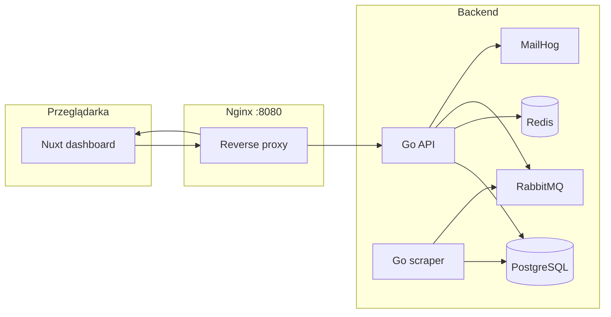

# Wiki Scraper Newsletter — example project

Publiczny **przykład** aplikacji do scrapowania Wikipedii z panelem użytkownika, filtrami stron i prostym modelem subskrypcji. Kod nie jest „zielonym projektem od zera” — powstał jako **odgałęzienie i adaptacja** prywatnego repozytorium autora (newsletter-scraper z podobną architekturą), przepisanego na domenę **Wikipedia Page**.

Do przeniesienia logiki z projektu prywatnego na ten publiczny example użyłem **Cursor (agenta AI)** w sposób celowy: porównywanie diffów między repozytoriami, kopiowanie modułów infrastruktury z zamianą ścieżek modułu Go, ręczna adaptacja modeli i API pod strony Wikipedia oraz świadome pomijanie elementów niepasujących do tej domeny (np. Grafana, produkcyjne PSP).

---

## Co ten projekt pokazuje

| Obszar | Opis |
|--------|------|
| **Scraper** | Go + Chrome (chromedp), pula przeglądarek, proxy per-site, retry przy 403/rate-limit |
| **API** | Gin, moduły routingu, DI (`Container`), JWT auth, idempotency (Redis) |
| **Dane** | PostgreSQL, migracje SQL, kolejka RabbitMQ |
| **Użytkownik** | Rejestracja, weryfikacja e-mail (MailHog), panel Nuxt 4 |
| **Filtry** | Zapisywane kryteria stron Wikipedia + dopasowania w panelu |
| **Subskrypcje** | Poziomy Basic/Premium, limity filtrów, example payment (stub PSP) |

---

## Architektura



**Porty (dev, domyślnie):**

| Usługa | URL |
|--------|-----|
| Dashboard | http://localhost:8080/dashboard/ |
| API | http://localhost:8080/api/ |
| MailHog | http://localhost:8080/mailhog/ |
| Adminer | http://localhost:8080/adminer/ |
| RabbitMQ | http://localhost:8080/rabbitmq/ |

---

## Stack technologiczny

- **Backend:** Go 1.25, Gin, GORM, golang-migrate, RabbitMQ, Redis
- **Scraper:** chromedp, JS scrapers w `app/resource/scraper/js/`
- **Frontend:** Nuxt 4, Vue 3, i18n (PL/EN)
- **Infra:** Docker Compose, Nginx, PostgreSQL 17, MailHog

---

## Szybki start

### Wymagania

- Docker + Docker Compose
- Wolny port **8080** (lub zmiana w `.env`)

### Uruchomienie (dev)

```bash
git clone https://github.com/kopolot/example-wikipedia-scraper.git
cd example-wikipedia-scraper

# Konfiguracja (pliki gitignored — trzeba utworzyć ręcznie)
cp app/config.example.json app/config.json
cp frontend/.env.example frontend/.env

# Stack deweloperski
./bin/run-local
# lub: docker compose -f compose.yaml -f compose.local.yaml up -d --build
```

### Pierwsze uruchomienie API i scrapera

Kontenery `app` i `scraper` w trybie dev **nie startują procesów automatycznie** — trzeba wejść do środka:

```bash
docker compose -f compose.yaml -f compose.local.yaml exec app sh
cd /app
go mod tidy
go run ./cmd/migrate/main.go   # migracje 000001–000009
air                            # API z hot-reload
```

Scraper (osobny kontener):

```bash
docker compose -f compose.yaml -f compose.local.yaml exec scraper sh
cd /app
go mod tidy
air -c .air.scraper.toml
```

Frontend w `compose.local.yaml` uruchamia się sam (`npm install && npm run dev`).

### Produkcja

```bash
./bin/run-prod
# lub: docker compose -f compose.yaml -f compose.prod.yaml up -d --build
```

---

## Konfiguracja (`app/config.json`)

Skopiuj z `app/config.example.json`. Kluczowe sekcje:

- **`redis`** — wymagany przez API (idempotency przy `POST /user/`, `POST /user/login`, `POST /order/`)
- **`payment_methods`** — np. `{ "name": "example", "enabled": true }` dla płatności testowej
- **`sites_to_scrape`** — lista stron; domyślnie `wikipedia.pl` z opcjonalnym `proxy_url`
- **`mailer`** — w dev kieruje na MailHog

---

## Funkcje użytkownika

### Auth i e-mail

1. Rejestracja → link weryfikacyjny w MailHog (`/mailhog/`)
2. Po weryfikacji — logowanie JWT
3. Maile HTML (rejestracja, reset hasła) przez `TemplateBuilder`

### Filtry stron (`/panel/wanted_filters`)

Użytkownik definiuje kryteria (słowa kluczowe, tytuł, serwisy). **Wymaga aktywnej subskrypcji** — bez niej CRUD filtrów i podgląd dopasowań są zablokowane.

### Subskrypcje i example payment

| Poziom | Limit filtrów | Produkty (seed) |
|--------|---------------|-----------------|
| Basic | 3 | 30 / 90 dni |
| Premium | 10 | 30 / 90 dni |

Flow:

1. Panel → Profil → **Kup subskrypcję** (`/panel/user/subscribe`)
2. Wybór planu + metody **example**
3. `POST /order/` → redirect na `/api/order/example_payment/{id}` (auto-akceptacja)
4. RabbitMQ → przedłużenie `subscription_level` i `subscription_expiration`

---

## Pochodzenie kodu (private → public example)

Projekt bazuje na **prywatnym repozytorium autora** o tej samej architekturze (Docker + Go API + scraper + Nuxt + panel użytkownika). Ten publiczny fork:

- **Zachował:** auth, kolejki, browser pool, idempotency, orders/subscriptions, example payment, panel
- **Przepisał:** modele i UI na `Page` / filtry stron Wikipedia
- **Pominął:** elementy specyficzne dla innej domeny źródłowej, Grafana/Loki, produkcyjne PSP

Synchronizacja z projektem prywatnym była robiona iteracyjnie z **Cursorem**: diff plików, zamiana ścieżek modułu, ręczna adaptacja policy/DTO/migracji, osobne commity per obszar.

---

## Migracje bazy

| Plik | Zawartość |
|------|-----------|
| 000001–000002 | `pages`, `users` |
| 000003 | `user_wanted_pages_filters` |
| 000004–000005 | pola subskrypcji na `users` |
| 000006–000008 | `products`, `orders`, `subscription_levels` |
| 000009 | seed planów Basic/Premium |

```bash
go run ./cmd/migrate/main.go
```

---

## Testy i build

```bash
# W kontenerze app
go build ./...
go test ./internal/...
go vet ./...
```

Część testów integracyjnych / browser wymaga sieci lub Chrome — patrz `AGENTS.md`.

---

## Roadmap

Zobacz [`TODO.md`](TODO.md). Główne braki: worker **notify** (powiadomienia e-mail o nowych stronach), dalsze testy, porządki w deploy.

---

## Autor i licencja

Example/portfolio — **Kopolot**. Prywatny projekt źródłowy nie jest publiczny; to repozytorium służy jako demonstracja architektury i współpracy człowiek + AI przy refaktoryzacji domeny na Wikipedia.
